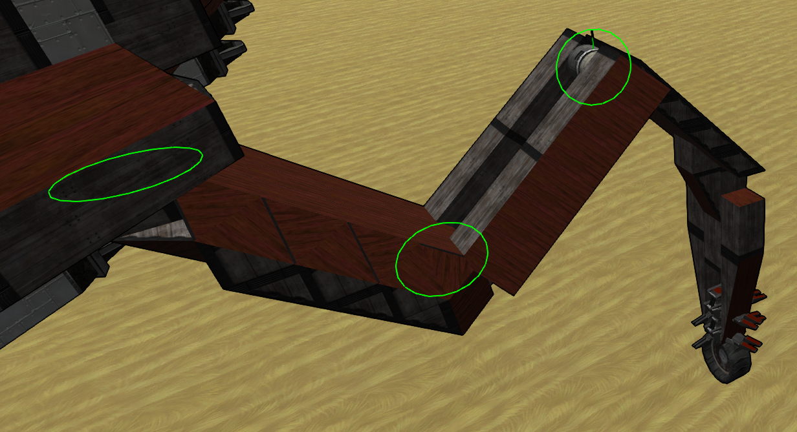
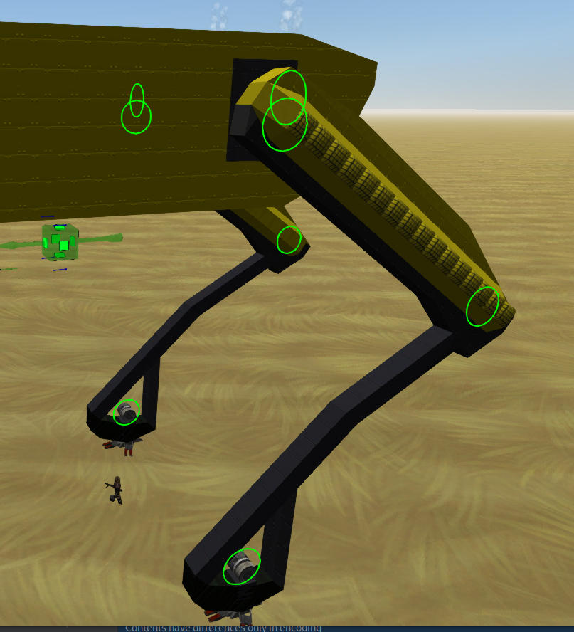

# Presentation
Youtube video :
[](https://www.youtube.com/watch?v=UBZWqCcn2_w "Spot Robot Dog Demo")
## Objective
The goal of this project is to create walking vehicles that can be driven by the AI or the player,
use the clampy foot as propulsion, have realistic leg movements,
and are as independent as possible of powered propulsion and stabilization.
## Operation
This is achieved via the Lua box component.
The code will first look for spinners placed in succession that form a legs,
it will use the template provided to build a model of the legs with some level of automatic configuration.
Then at each game loop, it will read the inputted commands from AI or player,
convert it to requested drive with smoothing transition,
calculate the position of the tip of the leg relative to its attachment point for each gait and mix them,
adjust the target position depending on the ground ditance to avoid hard collision, 
convert the desired position in angles for each spinner using an inverse kinematic model,
and move the spinners to the desired angle.
# How to use
As a demonstration craft, here is the blueprint of Spot Robot Dog, a state-of-the-art walker :
- [Spot Robot Dog Blueprint](resources/clampy-foot/spot-BD.blueprint)
## Legs
### Kinematic Structure
#### Inset Leg


A leg is composed of 3 segments, each segment starts with a spinner, followed by a straight line to the next segment.
The first segment starts by a vertical spinner pointing to the right, with blocks going in this direction,
The second segment attaches at the end of the first segment with a horizontal spinner,
and the third segment attaches to the second with a horizontal spinner and blocks going to the tip toward the right.
#### Chicken Leg


Based on the same general principles than the insect leg, the chicken leg is vertical at rest.
The first joint is a "hip" joint and rotate around the Z axis, it shifts the whole leg from left to right.
The second joint is oriented in the X axis and provide the forward/backward movement for the rest of the leg,
it should be just under the first joint (not on the side, as this would introduce some error in the IK calculation).
The third joint is a "knee" and also rotate around the X axis.
#### Human Leg
The human leg has the same config as the Chicken leg, except the inverse kinematic model will bend the knee forward.
#### Ankle Joint
As visible on the Spot leg, a fourth ankle joint is visible, 
this is an optional feature that allows a 4th joint to be used as ankle to maintain flat contact with the clampy foot.
it should be placed on the same axis as the previous knee joint independently of the leg model used.
### Clampy Foot
Clampy foot produces a strong force function of its relative speed with the ground when it is clamped.
This force is directly applied on the Center of Mass of the craft, and only one foot at a time can be clamped.
I usually disable constant force on the forward/backward and left/right axis and use the corresponding inputs instead,
this limits some unwanted forces being applied but will also stop braking and make the craft slide a little. 

### Placement
Legs can be placed in any number, mixed size and non-symmetrical position, however for best efficiency and balance
it is recommended to :
* Use an even number of leg
* Use 6 or more leg (4 or less is possible, but the craft will not be stable without active stabilization)
* The leg on the ground at the same time should allow the craft to be stable
## Input relay
In the current version, Lua does not support listening on all available input, especially forward/backward and left/right command.
In order to bypass this limitation, a spinner block is placed, which will turn on these commands,
which can then be interpreted by the Lua box.
To use the forward/backward command (used by the AI) :
* Place a spinner block on the main structure, in the upward position, oriented toward the front of the vehicle
* Using shift + n, name the spinner block "forwarder" ("strafer" for the left/right)
* On the first tab of the configuration, set it to "rotate to position"
* On the second tab, set the speed to 30rad/s
* On the third tab, check the box to use previous speed settings
* Set all response to command to 0
* Set response to forward/backward to 1
* Set power to 0.5
## Lua
### Configuration
Place a Lua block and copy the [code](Walking.lua) into it.
The parameters at the top can be let as is, you may wish to change CONTROLLER_CPS after all is working well to further tune the vehicle.
Replace the leg template in the buildArms function with your own, the params are as follows :
```
{
    { 
        gaitCenter = Vector3 : center point of the gait relative to the leg attachment point, default is calculated for insect legs, 
        phase = float : a value between 0 and 1 to offset the phase of this leg, default is 0 and 0.5 alternating between each leg,
        ikModel = IK_MODEL : one of the IK_MODEL value defined higher (INSECT (default), HUMAN, CHICKEN), this will configure the type of model used
        segments = { 
            { 
                len = Vector3 : legth of the first segment between its spinner and the sencod segment spinner, 
                spinOffset = offset in degree of the spinner, set to 0 if it is oriented to the right, 
                spinDirection = direction of spin, set 1 if the spinner is oriented upward, -1 if downward }, 
            { len = Vector3(0, 0, 5), spinOffset = 0, spinDirection = -1 },
            { len = Vector3(0, 0, 5), spinOffset = 0, spinDirection = -1 },
            { len = Vector3(0, 0, 1.5), spinOffset = 0, spinDirection = 1 } -- optional ankle segment
        } 
    },
    ...
}
```
Note on this configuration :
* The legs are searched in counter-clockwise order around the COM, starting from the bottom right up until bottom left.
* Despite giving length as a Vector3, some components are currently ignored (like the first segment upward offset), but it may be useful in future version.
* The inverse kinematic code expects the 0 degree angles to produce a straight leg pointing right, it is recommended to build and place the leg in this orientation.
* The spin direction may vary depending on the previous spinner direction, it may be necessary to test and change it a few times until the correct setting is found.
# Miscellaneous tips
* Legs are positioned relative to the COM of the craft when the script starts, however, in my tests the COM is sometimes the first block of the craft, so ideally you should place your first block at the center.
* If the leg can't travel to a point, a HUD message will be logged. try reducing the GAIT_SIZE_FACTOR param.
* Yaw gait does not produce yaw since the clampy foot yaw is very weak and only one foot is active simultaneously. 
The yaw gait is purely cosmetic and can be disabled by setting GAIT_YAW_FACTOR at 0.
* All gait can be individually disabled or tuned via their relative GAIT_FACTOR param.
* The adjuster allows the leg to flex a little instead of slamming to the ground.
* Some data like the leg configuration are cached, removing legs will break the code. To fix this, copy the code, destroy the lua block, replace it and paste back the code.
* Big walker ~~(150+ span between legs) will break the game physics and cause 10x slow down when walking.~~ are now functional!
* Small and light walker does not work very well with the physics en the game, use lead if necessary.
* The leg model works better if the clampy foot is at the point of the leg and stay so all the time 
* (flat foot may introduce problems when unbalanced or when not used with an ankle)
* The coordinate system used to reference relative position is defined as (x, y, z) for (right, top, forward).
* A gait is a trajectory of the foot relative to the attachment point of the leg.
# Contributing
If you wish to contribute by proposing evolution, pointing bug or making grammatical change to this guide, please open a github issue or directly propose a pull request for trivial changes.
