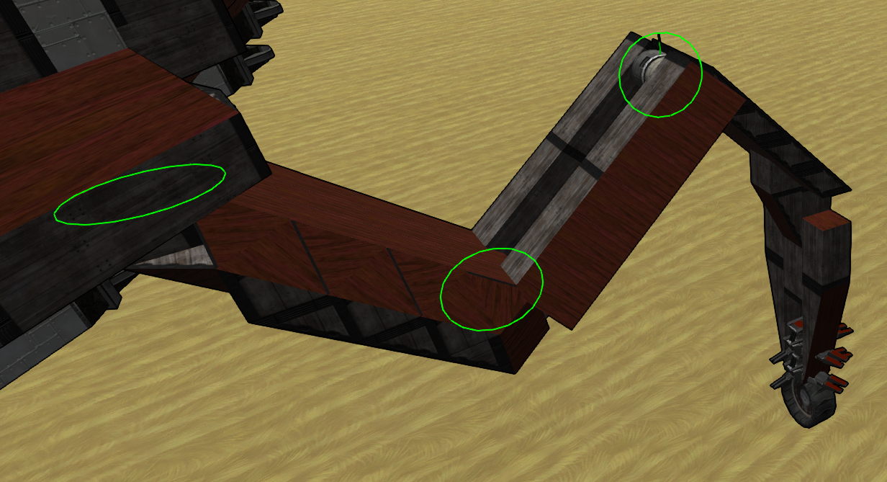

# Presentation
## Objective
The goal of this project is to create walking vehicles that can be driven by the AI or the player, 
use the sticky foot as propulsion, have realistic leg movements, 
and don't rely on powered stabilization or propulsion.

[](https://www.youtube.com/watch?v=1kIcjcPTpyM "Land Marauder Demo")

## Operation
This is achieved via the LUA box component. 
The code will first look for spinner placed in succession that form legs, 
it will use the template provided to build a model of the legs with some level of automatic configuration.
Then at each game loop, it will read the inputted commands from AI or player, 
convert it to requested drive with smoothing transition,
calculate the position of the tip of the leg relative to its attachment point for each gait and mix them,
convert the desired position in angles for each spinner using an inverse kinematic model,
move the spinner to the desired angle.
# How to use
## Legs
### Kinematic structure



A leg is composed of 3 segments, each segment starts with a spinner, followed by a straight line to the next segment.
The first segment starts by a vertical spinner pointing to the right, with blocks going in this direction,
The second segment attaches at the end of the first segment with a horizontal spinner, 
and the third segment attaches to the second with a horizontal spinner and blocks going to the tip toward the right.
### Sticky foot
Sticky foot produces thrust when moving relative to the ground, they are to be placed on the last segment near the tip.
Horizontal orientation does not matter, here are the recommended configuration :
* Clearance : sphere of influence of the sticky foot, usually 0.5 or 1m for a sticky foot touching the ground.
* Stickiness : how long will it keep producing thrust after leaving the clearance zone, set to 100.
* Forward/Backward : must be active at all time, set resting drive to 1.
### Wheel
Wheels are placed at the tip of each leg and make contact with the ground. 
Without it, every imbalance or bump in the ground would cause a leg to push hard on the ground 
and imbalance further the vehicle.
The configuration of the wheels is very delicate and is the harder part of building a walker.
Here are some explanation and tips for the configuration :
* Spring length : the spring must not be fully compressed, so a length of at least 1m is recommended, 2m works better.
* Spring strength : the spring must not fully compress, and since half of the wheel will not may contact, a strength of 40 is a minimum, 50 works well too but may reduce absorption.
* Damper (rebound) force : allows to produce a counter force when compressing (expanding), this will cause strong imbalance on light vehicle and must be kept at 0 - 0.1, but a damper force will help the spring to not fully compress, it should be set to 0 and raised little by little.
* Friction : helps stop the craft at rest, but too much will counter the foot thrust too much, 0.5 is a good value.
* Spring extension : used to artificially lower the starting point of the spring, should be set so that the fully compressed wheel barely go past the tip of the leg.
### Placement
Legs can be placed in any number, mixed size and non-symmetrical position, however for best efficiency and balance
it is recommended to :
* Use an even number of leg
* Use 6 or more leg (4 is possible, but the craft will not be stable while half of the legs are up)
* Have each set of leg that are on the ground at the same time should have a center of lift and thrust that coincides with the center of mass of the vehicle
## Input relay
In the current version, LUA does not support listening on all available input, especially forward/backward command.
In order to bypass this limitation, a spinner block is placed, which will turn on these command, 
which can then be interpreted by the LUA box.
To use the forward/backward command (used by the AI) : 
* Place a spinner block on the main structure, in the upward position, oriented toward the front of the vehicle
* Using shift + n, name the spinner block "forwarder"
* On the first tab of the configuration, set it to "rotate to position"
* On the second tab, set the speed to 30rad/s
* On the third tab, Check the box to use previous speed settings
* Set all response to command to 0
* Set response to forward/backward to 1
* Set power to 0.5
## LUA
### Configuration
Place a LUA block and copy the [code](Walking.lua) into it.
The parameters at the top can be let as is, you may wish to change CONTROLLER_CPS after all is working well to further tune the vehicle.
Replace the leg configuration in the buildArms function with your own, the params are as follows :
```
{
    { 
        gaitCenter = Vector3 : center point of the gait relative to the leg attachment point, 
        phase = float : a value between 0 and 1 to offset the phase of this leg, default is 0 and 0.5 alternating between each leg,
        segments = { 
            { 
                len = Vector3 : legth of the first segment between its spinner and the sencod segment spinner, 
                spinOffset = offset in degree of the spinner, set to 0 if it is oriented to the right, 
                spinDirection = direction of spin, set 1 if the spinner is oriented upward, -1 if downward }, 
            { len = Vector3(0, 0, 5), spinOffset = 0, spinDirection = -1 },
            { len = Vector3(1, 0, 5.5), spinOffset = 0, spinDirection = -1 }
        } 
    }, -- bottom right
    ...
}
```
Note on this configuration : 
* The legs are searched in counter-clockwise order, starting from the bottom right up until bottom left.
* Despite giving length as a Vector3, some components are currently ignored (like the first segment upward offset), but it may be useful in future version.
* The inverse kinematic code expects the 0 degree angles to produce a straight leg pointing right, it is recommended to build and place the leg in this orientation.
* The spin direction may vary depending on the previous spinner direction, it may be necessary to test and change it a few times until the correct settings is found.
# Miscellaneous tips
* If the leg can't travel to a point, a HUD message will be logged. try using a better gait center for this leg.
* While being implemented, Strafing is not supported due to the working of the sticky foot, that only produces forward and backward thrust relative to the vehicle.
* Some data like the leg configuration are cached, removing legs will break the code. To fix this, copy the code, destroy the lua block, replace it and paste the code.
* Big walker (150+ span between legs) will break the game physics and cause 10x slow down when walking.
* Small and light walker does not work very well with the physics en the game, use lead if necessary.
* Each leg need multiple sticky foot, add more if necessary.
* The coordinate system used to reference relative position is defined as (x, y, z) for (right, top, forward).
* A gait is a trajectory of the foot relative to the attachment point of the leg.
# Contributing
If you wish to contribute by proposing evolution, pointing bug or making grammatical change to this guide, please open a github issue or propose a pull request for trivial changes.
